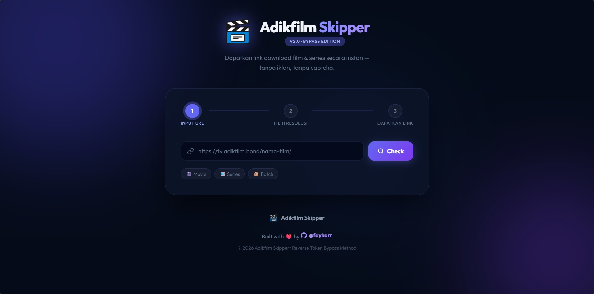

# 🎬 Adikfilm Skipper

> Bypass link download film & series dari Adikfilm secara instan — tanpa iklan, tanpa captcha.

[](https://github.com/faykarr)
[](https://nodejs.org)
[](https://vercel.com)
[](LICENSE)

---

## 📸 Preview



---

## ✨ Fitur

- 🎬 **Movie** — Pilih resolusi (480p, 720p, 1080p, 4K, dst.)
- 📺 **Series** — Pilih episode lalu resolusi secara terpisah
- 📦 **Batch** — Unduh semua episode sekaligus, langsung pilih resolusi
- ⚡ **Token Decoder** — Reverse engineering token tpi.li/ShrinkEarn untuk melewati captcha & iklan secara instan
- 🤖 **Chromium Stealth** — Melewati proteksi Cloudflare menggunakan `@sparticuz/chromium`
- 🎯 **Provider Priority** — Otomatis prioritaskan GdFlix → Acefile → Mega → TBox → Pixel
- ☁️ **Vercel Ready** — Deploy langsung ke Vercel tanpa konfigurasi tambahan

---

## 🛠️ Tech Stack

| Layer | Teknologi |
|---|---|
| Backend | Node.js + Express.js |
| Browser Engine | `@sparticuz/chromium` + `puppeteer-core` |
| HTML Parser | Cheerio |
| Serverless | Vercel API Routes (`/api/*.js`) |
| Frontend | Vanilla HTML/CSS/JS |

---

## 🚀 Cara Menjalankan Lokal

### Prerequisites
- Node.js v18+
- Google Chrome (terinstall di sistem)

### Instalasi

```bash
# Clone repo
git clone https://github.com/faykarr/adikfilm-skipper.git
cd adikfilm-skipper

# Install dependencies
npm install

# Jalankan server
npm start
```

Buka browser: **http://localhost:3000**

---

## ☁️ Deploy ke Vercel

### Cara 1 — Via GitHub (Rekomendasi)

1. Push repo ke GitHub
2. Buka [vercel.com](https://vercel.com) → **New Project**
3. Import repo `adikfilm-skipper`
4. Biarkan semua setting default → klik **Deploy**

### Cara 2 — Via Vercel CLI

```bash
npm install -g vercel
vercel login
vercel --prod
```

> [!NOTE]
> Tidak perlu konfigurasi build command. `vercel.json` sudah mengatur semua routing dan function settings secara otomatis.

> [!WARNING]
> Vercel **Free Tier** membatasi timeout function hingga **10 detik**. Karena proses bypass membutuhkan 15–30 detik, disarankan menggunakan **Pro Tier** (timeout hingga 60 detik).

---

## 📖 Cara Penggunaan

1. Tempel URL film atau series dari `tv.adikfilm.bond`
2. Klik **Check** — sistem scraping info film (±15 detik)
3. Pilih **episode** (jika series) dan **resolusi** yang diinginkan
4. Klik **Bypass & Get Link** — token didekode otomatis
5. Link download langsung muncul — klik **Download Sekarang**!

### Contoh URL

```
# Movie
https://tv.adikfilm.bond/anaconda-2025/

# Series Per Episode  
https://tv.adikfilm.bond/tv/a-knight-of-the-seven-kingdoms-2026/

# Series Batch
https://tv.adikfilm.bond/tv/wonder-man-2026/
```

---

## ⚙️ Cara Kerja

```
URL Film (tv.adikfilm.bond)
    │
    ▼ [Chromium Headless]
Scrape daftar resolusi / episode
    │
    ▼ [Pilih Provider: GdFlix / Acefile / ...]
go.adikfilm.link → /api/link?provider=1 (ShrinkEarn)
    │
    ▼
tpi.li — ambil input[name="token"]
    │
    ▼ [Base64 Reverse Engineering]
Decode Base64 dari 'aHR0cHM6...'
    │
    ▼
✅ Link Download Asli (GDFlix / Acefile / dll)
```

---

## 📡 API Endpoints

### `POST /api/info`

```json
// Request
{ "url": "https://tv.adikfilm.bond/anaconda-2025/" }

// Response
{
  "success": true,
  "data": {
    "title": "Anaconda (2025)",
    "isSeries": false,
    "resolutions": [
      { "label": "720p", "anchors": [{ "text": "GdFlix", "href": "https://go.adikfilm.link/..." }] }
    ],
    "episodes": {}
  }
}
```

### `POST /api/skip`

```json
// Request
{ "goUrl": "https://go.adikfilm.link/?url=...&origin=adikfilm" }

// Response
{ "success": true, "downloadUrl": "https://gdflix.dev/file/xxxxx" }
```

---

## 📁 Struktur Proyek

```
adikfilm-skipper/
├── api/
│   ├── info.js          ← Serverless: scrape info film
│   └── skip.js          ← Serverless: bypass & decode token
├── public/
│   ├── images/
│   │   ├── cropped-iconku-1.png  ← Logo
│   │   └── screenshot.png        ← Preview UI
│   ├── index.html
│   ├── script.js
│   └── style.css
├── server.js            ← Local dev server
├── vercel.json          ← Konfigurasi Vercel
└── package.json
```

---

## 📝 License

MIT © 2026 [@faykarr](https://github.com/faykarr)
